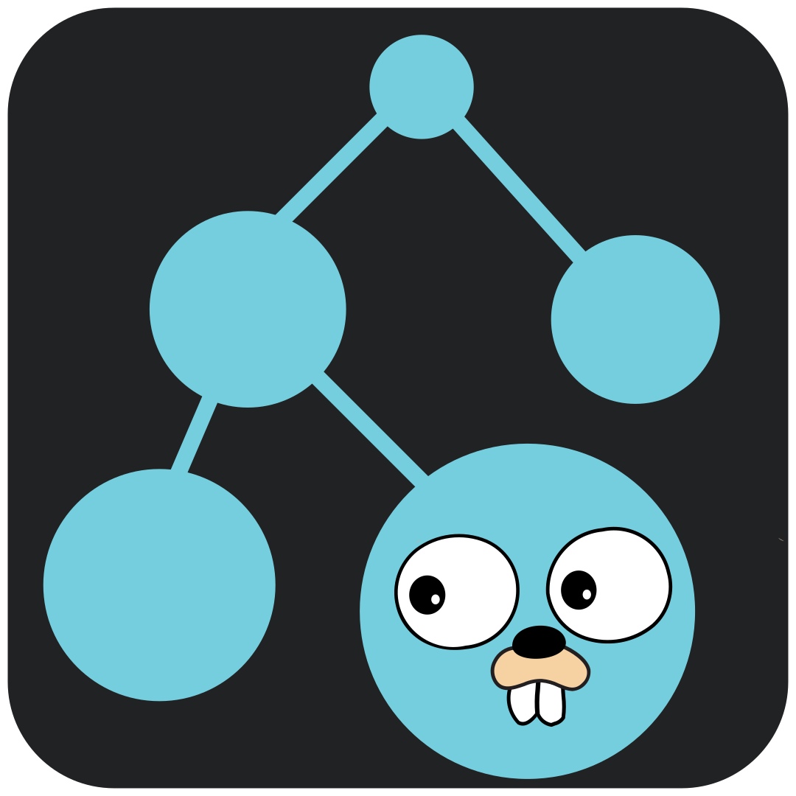

> WARNING: This package is currently under a period of intense development and will be extremely unstable until version `v0.5.0`.

# GoEvo - Extensible Evolutionary Algorithms

GoEvo is an evolutionary algorithms package for Go that provides both flexible and fast implementations of many genetic algorithms.

Some Key Features:
- **Many Algorithms**: Support for many types of evolutionary algorithms, from basic hill-climbers to full [NEAT](https://nn.cs.utexas.edu/downloads/papers/stanley.ec02.pdf).
- **Optimize Anything**: NEAT genotypes, slices of floats, or any type that you can perform crossover, mutation, and fitness evaluation on are supported by this package.
- **Flexible for Your Use-Case**: As long as your components (such as mutation functions, selection functions, etc) implement the easy-to-understand interfaces specified, you can implement interesting and unique custom behavior.

## Documentation
Currently, the only documentation can be found on the [pkg.go.dev](https://pkg.go.dev/github.com/JoshPattman/goevo) website. However, examples and possibly a wiki will be coming soon.

## Components
GoEvo is broken down into distinct components, each of which may have multiple implementations to provide various behaviors. Below are the different types of components in GoEvo:
- **Genotype** - A structure representing an organism's DNA, it can be anything from an array of floats to a NEAT neuron graph
- **Phenotype** - Some genotypes, such as neat, require a sort of compiling step to allow them to be used, a phenotype is the result of this compiling
- **Reproduction** - How can some number of organisms be combined and mutated to create a new child
- **Mutation** - Genotype-specific, it represents a strategy to make some mutations on a Genotype
- **Crossover** - Genotype-specific, it represents a strategy to combine some number of parents to create a child (without mutation)
- **Selection** - Given some number of agents, each with their own fitness, choose one to be a parent
- **Population** - A higher level concept that stores some number of agents, and is capable of creating a new generation

## Built-In Components List
Below are the components that GoEvo currently ships with. If you require one that is not included, feel free to create it and make a pull request!

### Genotypes, Mutations, and Crossovers
- `NeatGenotype` - Provides a [NEAT](https://nn.cs.utexas.edu/downloads/papers/stanley.ec02.pdf) (Neuro Evolution of Augmenting Topologies) gene graph
	- `NeatCrossoverAsexual` - Crossover to clone one parent
	- `NeatCrossoverSimple` - Clones the topology of one parent but randomly chooses weights from the other
	- `NeatMutationStd` - Mutates a genotype with normally distributed values
- `ArrayGenotype` - Provides a genotype that is a slice of values
	- `ArrayCrossoverAsexual` - Crossover to clone one parent
	- `ArrayCrossoverKPoint` - K-Point crossover
	- `ArrayCrossoverUniform` - Uniform crossover
	- `ArrayMutationStd` - Mutates with normal distribution for float arrays
	- `ArrayMutationRandomBool` - Randomly switches bool values
	- `ArrayMutationRandomRune` - Randomly switches rune values

### Selections
- `TournamentSelection` - N-sized tournament selection
- `EliteSelection` - Always pick the best agent

### Populations
- `SimplePopulation` - One species generational population
- `SpeciatedPopulation` - Generation population with multiple species
- `HillClimberPopulation` - Population with two agents that perform hill climbing

## TODO pre `v0.5.0`
- NEAT Population
- Dense genotype using Gonum
- Add more tests and clean up the testing file
- Add an example dir