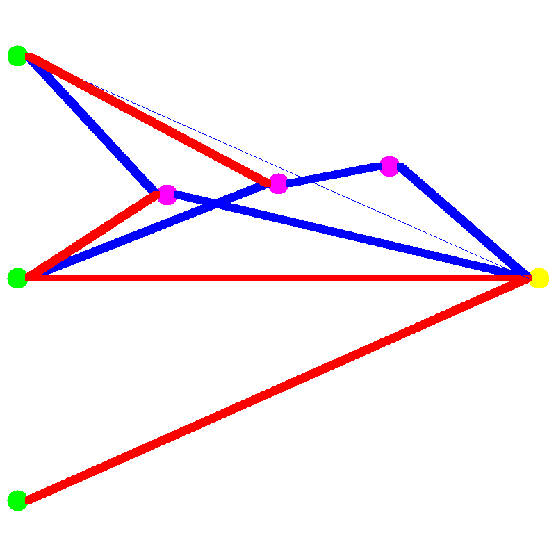

# `goevo` - work-in-progress NEAT implementation in Golang
GoEVO is designed to be a fast but easy-to-understand package that implements the NEAT algorithm. It is still in development and has not had a major release yet, so stability is not guaranteed. If you find a bug or have any suggestions, please do raise an issue and i'll try to fix it. \
To learn more about the NEAT algorithm, here is the original paper: [Stanley, K. O., & Miikkulainen, R. (2002). Evolving neural networks through augmenting topologies. Evolutionary computation, 10(2), 99-127.](https://nn.cs.utexas.edu/downloads/papers/stanley.ec02.pdf)
## Usage
### Creating and Modifying a `Genotype`
A Genotype is a bit like DNA - it encodes all the information to build the network.
```go
// Create a counter. This is used to keep track of new neurons and synapses
counter := goevo.NewAtomicCounter()

// Create the initial genotype. This is sort of like an agents DNA.
genotype := goevo.NewGenotype(counter, 2, 1, goevo.ActivationLinear, goevo.ActivationSigmoid)

// Add a synapse from first input to output with a weight of 0.5.
// We don't need to check the error because we know this is a valid modification
synapseID, _ := genotype.AddSynapse(counter, 0, 2, 0.5)
// Add a neuron on the synapse we just created
neuronID, secondSynapseID, _ := genotype.AddNeuron(counter, synapseID, goevo.ActivationReLU)
// Add a synapse between the second input and our new neuron with a weight of -0.5
genotype.AddSynapse(counter, 1, neuronID, -0.5)
```
### Visualising a `Genotype`
It is quite hard to deduce the topology by looking its list of neurons and synapses. `goevo` supports drawing a picture of a genotype either to a `draw.Image` or a `png` or `jpg` file.
```go
vis := goevo.NewGenotypeVisualiser()
vis.DrawImageToPNGFile("example_1.png", genotype)
```
Below is the image in the generated file `example_1.png`. The green cirlces are input neurons, pink circles are hidden neurons, and yellow circles are output neurons. A blue line is a positive weight and a red line is a negative weight. The thicker the line, the stronger the weight.


### Pruning Synapses
One way to prevent the networks getting too big is to prune synapses (delete synapses). Pruning will remove the given synapse, then remove all neurons and synapses that become redundant due to the pruning.
```go
// Prune the synapse that connects the hidden neuron to the output neuron. This makes the hidden neuron nedundant so it is therefor removed too, along with its other synapses.
genotypePrunedA := goevo.NewGenotypeCopy(genotype)
genotypePrunedA.PruneSynapse(secondSynapseID)
vis.DrawImageToPNGFile("example_2.png", genotypePrunedA)
// Prune the synapse that connects the first input to the hidden neuron
genotypePrunedB := goevo.NewGenotypeCopy(genotype)
genotypePrunedB.PruneSynapse(synapseID)
vis.DrawImageToPNGFile("example_3.png", genotypePrunedB)
```

Below is `example_2.png`. Because the removed synapse was the only synapse connecting the hidden node to an output node, the hidden node was removed with the synapse, along with its synapses.


Below is `example_3.png`. The hidden node still had a connection going in and a connection going out after this pruning so it was not removed.


### Using the `Genotype`
A Genotype cannot directly be used to convert an input into an output. Instead, it must first be converted into a Phenotype, which can be thought of a bit like compiling code into an executable. After a Phenotype is created, it can be used as many times as you like, but the neurons and synapses cannot be edited (to do this you have to modify the genotype and create a new phenotype).
```go
// Create a phenotype from the genotype
phenotype := goevo.NewPhenotype(genotype)
// Calculate the outputs given some inputs
fmt.Println(phenotype.Forward([]float64{0, 1}))
fmt.Println(phenotype.Forward([]float64{1, 0}))
// Make sure to clear any recurrent connections memory (in this case there are no recurrent connections but this is just an exmaple)
phenotype.ClearRecurrentMemory()
```
Output:
```
[0.5]
[0.6224593312018546]
```

### Saving and Loading `Genotype`
If you have just trained a genotype, you may wish to save it. Genotypes can be json marshalled und unmarshalled with go's built-in json parser.
```go
// Convert the genotype to a json []byte
jsBytes, _ := json.Marshal(genotype)
// Create an empty genotype and load the json []byte into it
genotypeLoaded := goevo.NewGenotypeEmpty()
json.Unmarshal(jsBytes, genotypeLoaded)
```

## Example - XOR
In this example, a population of agents attempts to create a genotype that can do XOR logic. The generational loop for this example is as follows:
1) Every agents fitness is evaluated
2) The best agent is picked, all others are discarded
3) The population is filled with clones of the best agent, who may have mutations

This a a very primative training loop, and ignores many of the key features of the NEAT paper such as speciation and crossover. However, I have not implemented those yet (see TODO at the bottom of the README). Despite this, the algorithm still performs quite well, reaching a mean squared error of less than 0.001 in around 60 generations with a population size of 100.

```go
// Define the dataset. In this exmaple this data corresponds to XOR.
// The third index of each X datapoint is the bias, which is important because each neuron does not have its own bias
X := [][]float64{{0, 0, 1}, {0, 1, 1}, {1, 0, 1}, {1, 1, 1}}
Y := [][]float64{{0}, {1}, {1}, {0}}

// Define the fitness function. The algorithm will try to maximise fitness. In this particular function the best score a network can get is 0 and the worst is -infinity
fitness := func(g *goevo.Genotype) float64 {
    p := goevo.NewPhenotype(g)
    totalSqaredError := 0.0
    for i := range X {
        totalSqaredError += math.Pow(Y[i][0]-p.Forward(X[i])[0], 2)
    }
    return -totalSqaredError / float64(len(X))
}

// Create a counter. This is used to keep track of new neurons and synapses
counter := goevo.NewAtomicCounter()

// Create the initial genotype. All other genotypes in the population will start as offspring from this.
// It is important to create a single genotype as a commom ancestor because then the input and output neurons of the whole population will have the same ids from the counter
genotypeAncestor := goevo.NewGenotype(counter, 3, 1, goevo.ActivationLinear, goevo.ActivationSigmoid)
// To start off easy, we will manually connect all inputs to the output, which gives the network a head start
genotypeAncestor.AddSynapse(counter, 0, 3, 0.5)
genotypeAncestor.AddSynapse(counter, 1, 3, 0.5)
genotypeAncestor.AddSynapse(counter, 2, 3, 0.5)

// Create a population of 100 genotypes
population := make([]*goevo.Genotype, 100)
for pi := range population {
    population[pi] = goevo.NewGenotypeCopy(genotypeAncestor)
}

// Do a maximum of 5000 generations
for generation := 0; generation < 5000; generation++ {
    // Find the agent with the best fitness
    bestFitness := math.Inf(-1)
    bestFitnessIndex := -1
    for i := range population {
        f := fitness(population[i])
        if f > bestFitness {
            bestFitness = f
            bestFitnessIndex = i
        }
    }
    bestGenotype := population[bestFitnessIndex]

    // Repopulate the population with offspring of the best agent
    for i := 0; i < len(population); i++ {
        population[i] = goevo.NewGenotypeCopy(bestGenotype)
        // Synapse creation
        if rand.Float64() > 0.8 {
            goevo.AddRandomSynapse(counter, population[i], 0.2, false, 5)
        }
        // Synapse mutations
        if rand.Float64() > 0.8 {
            goevo.MutateRandomSynapse(population[i], 0.5)
        }
        if rand.Float64() > 0.4 {
            goevo.MutateRandomSynapse(population[i], 0.1)
        }
        // New neuron creation
        if rand.Float64() > 0.9 {
            goevo.AddRandomNeuron(counter, population[i], goevo.ActivationReLU)
        }
    }
    population[0] = bestGenotype

    // Check to see if we have reached our target fitness. If we have, stop looping
    if bestFitness > -0.001 {
        fmt.Println("Reached target fitness in", generation, "generations")
        break
    }
}

// Create a phenotype from the best network and calculate what its predictions for the dataset are
p := goevo.NewPhenotype(population[0])
for i := range X {
    fmt.Println("X", X[i], "Y", Y[i], "YP", p.Forward(X[i]))
}
// Visualise what the genotype looks like
v := goevo.NewGenotypeVisualiser()
v.DrawImageToPNGFile("xor.png", population[0])
```

Here is the ouput from running this once:
```
Reached target fitness in 56 generations
X [0 0 1] Y [0] YP [0.041903360177595196]
X [0 1 1] Y [1] YP [0.9803748834155143]
X [1 0 1] Y [1] YP [0.9598753334944649]
X [1 1 1] Y [0] YP [0.012205476415211636]
```

The final network is rather large compared to the minimal network required for XOR. However, the algorithm can be made to create smaller networks by adding a penalty for large networks in the training function. This is a very good idea to do if you plan to use NEAT, as the whole purpose of it is to create optimal topologies.



## TODO
- Add speciation
- Add crossover
- Figure out how to fully implement the NEAT algorithm without taking away too much control
- Add a function to remove a neuron and re-route its synapses
- Add a function to change a neurons activation
- For the above two, add functions to randomly perform those actions