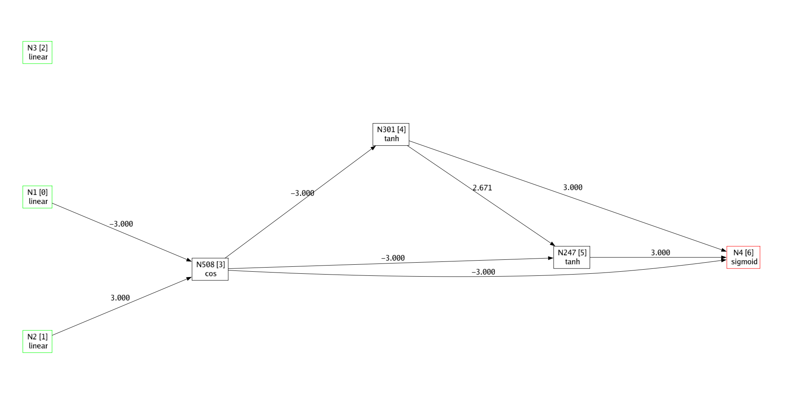
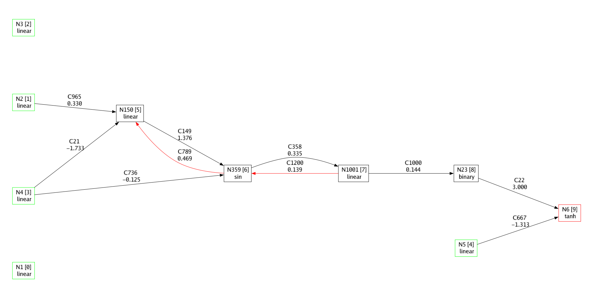

# GoEvo Rewrite
This branch is an experimental rewrite from the ground up. I am making it as fast, simple, and bug-free as possible.

# GoEvo - Evolutionary Algorithms Based on NEAT, in Golang
GoEvo is a package for Go that performs a variety of evolutionary algorithms to optimise a neural network. The networks do not only evolve their weights, but also the neurons within, and therefore their whole structure. I have tried to base GoEvo networks on the ones described in the original NEAT paper, [Evolving Neural Networks Through Augmenting Topologies](https://nn.cs.utexas.edu/downloads/papers/stanley.ec02.pdf), however, I have taken some liberties during development. Despite this, the networks function in broadly the same way as originally described.

GoEvo also does not just support the NEAT algorithm. NEAT genotypes can be used with many other types of genetic algorithms, with various methods of selection, mutation, and speciation. For this reason, GoEvo strives to support many different algorithms, all focusing on optimising the genotype type, which equates to DNA. GoEvo is also built to be very extensible, allowing the user to implement new evolutionary processes with ease.

## About NEAT
NeuroEvolution of Augmenting Topologies (NEAT) is an algorithm to grow neural networks optimised for a specific task. Instead of traditional machine learning, NEAT is not usually used in a supervised manner where the correct answer is always known, but instead tends to be used in scenarios like controlling a robot to walk, where there is no _correct_ solution to the problem.

There are two main components to NEAT:
- Genotype/phenotype: A genotype represents DNA, and can be crossed over and mutated. A phenotype is the brain that results from _compiling_ the genotype. The phenotype is the part that can take a set of inputs and return an output.
- Evolutionary Algorithm: This is analogous to the environment that the phenotypes live in. The Evolutionary algorithm of NEAT tracks each genotype and assigns it to a species. The Evolutionary algorithm also chooses which genotypes can reproduce to create the next generation.

In GoEvo, there is only one genotype implementation, but there are many alternative evolutionary algorithm implementations, including the original NEAT one.

## Example Genotype
Below is a visualisation (generated by the `Draw()` method) of a genotype that was evolved to solve the XOR problem. Data flows from right to left in this drawing. Green nodes represent input neurons, black nodes are hidden neurons, and red nodes are outputs.
Each node has a unique ID (`N301` for example), an execution order (`[4]`), and an activation (`tanh`). Synapses, represented by arrows, each have a weight, which in this instance was capped between -3 and 3.



You may have noticed that there are three inputs, instead of the two you would expect. This is because NEAT networks you need to manually add a bias by appending an additional `1` onto the end of the input sequence. In this case, the bias node, represented as `N3`, is actually not connected to any other nodes, suggesting that it was not necessary.

To validate the network does indeed work, I hardcoded the evolved network quickly in python, in the file README_ASSETS/xor.py. You can see that the network does in fact perform an XOR operation.

## GoEvo Features
- Fast gene mutation and crossover
- Efficient execution of genes by first _compiling_ them into a Phenotype
- Both forward and recurrent connections supported
- Hidden neurons can each have different activations
- Supports many types of genetic algorithms for evolving Genotypes
- Easy saving and loading of genotypes using json
- Supports drawing genotypes to an image using graphviz
- You write the generational loop to suit your own needs, leading to much higher customisability

## Example - Cartpole
Below is an example of using GoEvo to create an agent to balance a pole on a cart that can move left or right.

```golang
package main

import (
	"encoding/json"
	"fmt"
	"image/png"
	"math"
	"os"

	"github.com/JoshPattman/goevo"
	"github.com/JoshPattman/gym"
	"github.com/gopxl/pixel/pixelgl"
)

// This function takes a phenotype and an environment (designed for cartpole), and outputs a fitness.
// The fitness is based on how many steps the phenotype was able to stay alive in the environemnt.
func fitness(pt *goevo.Phenotype, e gym.Env) float64 {
	reps := 10
	total := 0.0
	for r := 0; r < reps; r++ {
		lastObs := e.Reset().Observation
		pt.Reset()
		for s := 0; s < 60*10; s++ {
			action := pt.Forward(append(lastObs, 1))
			sd := e.Step(action)
			if sd.Terminated {
				break
			}
			// We use +1 here instead of using the reward returned by the environment as i have found it to work better in this situation.
			// This may not be a valid solution in an environment where finishing a level fast is the goal.
			total += 1
			lastObs = sd.Observation
		}
	}
	return total / float64(reps)
}

func main() {
	// Initialise the environment we will use for training our AI.
	env := gym.NewCartPoleEnv(gym.DefaultCartPoleSettings)

	// Initialise the counter that will be used to assign new neurons and synapses an innovation ID
	ctr := goevo.NewCounter()

	// Create a population all cloned from a last common ancestor.
	// It is very important that we do this so all of the genotypes have the same IDs for their corresponding input and output nodes.
	// We will create a simple population of size 100, which means that there will only be a single species.
	lca := goevo.NewGenotype(ctr, env.ObservationLength()+1, env.ActionLength(), goevo.Tanh)
	pop := goevo.NewSimplePopulation(func() *goevo.Genotype {
		return lca.Clone()
	}, 100)

	// Initialise our selection function: tournament selection with a size of three.
	// In goevo, selections and reproductions do not have "NewXXX" functions.
	selec := &goevo.TournamentSelection{
		TournamentSize: 3,
	}

	// Initialise the reproduction function, which uses normally distributed random numbers to perform mutations
	reprod := &goevo.StdReproduction{
		StdNumNewSynapses:          0.5,
		StdNumNewRecurrentSynapses: 0.2,
		StdNumNewNeurons:           0.25,
		StdNumMutateSynapses:       1.5,
		StdNumPruneSynapses:        0.0,
		StdNumMutateActivations:    0.1,
		StdNewSynapseWeight:        0.2,
		StdMutateSynapseWeight:     0.2,
		MaxHiddenNeurons:           4,
		Counter:                    ctr,
		PossibleActivations:        goevo.AllActivations,
	}

	// Track the best genotype of the previous generation
	var bestGt *goevo.Genotype

	// Loop for 200 generations
	for gen := 1; gen <= 200; gen++ {
		// Calculate the fitness of all agents, tracking the best fitness and genotype as we go.
		// An agent is just a genotype paired with a fitness.
		bestFitness := math.Inf(-1)
		bestGt = nil
		for _, a := range pop.Agents() {
			a.Fitness = fitness(a.Genotype.Build(), env)
			if a.Fitness > bestFitness {
				bestFitness = a.Fitness
				bestGt = a.Genotype
			}
		}
		// Every 10 generations, log some information
		if gen%10 == 0 || gen == 1 {
			fmt.Printf("Generation %v: bestf=%.3f\n", gen, bestFitness)
		}

		// Get the next generation of agents using our selection and reproduction functions
		pop = pop.NextGeneration(selec, reprod)
	}

	// Save an image of the best genotype we found
	fImg, _ := os.Create("best_genotype.png")
	defer fImg.Close()
	png.Encode(fImg, bestGt.Draw(20, 10))

	// Save the genotype to a file
	fJson, _ := os.Create("best_genotype.json")
	defer fJson.Close()
	enc := json.NewEncoder(fJson)
	enc.SetIndent("", "\t")
	enc.Encode(bestGt)

	// Compile the genotype into a phenotype so we can actually run number through it
	bestPt := bestGt.Build()

	// Until we press escape, run the genotype in a visualisation of the environment.
	// Press R to reset the environment.
	lastObs := env.Reset().Observation
	gym.BeginRenderLoop(env, func(win *pixelgl.Window) bool {
		action := bestPt.Forward(append(lastObs, 1))
		sd := env.Step(action)
		lastObs = sd.Observation
		bestPt.Reset()
		if sd.Terminated || win.JustPressed(pixelgl.KeyR) {
			lastObs = env.Reset().Observation
		}
		return win.JustPressed(pixelgl.KeyEscape)
	})
}

```

This code took about 15 seconds to run on my laptop, and produced a pretty good pole balancer. There are plenty of improvements to be made though, like testing each agent for more timesteps.

Below is the genotype that was generated. Red connections are recurrent ones, meaning they carry data from the previous timestep into the next one.



You can see that the nodes in the genotype are fairly sparsely connected, and two of the input nodes are actually not used at all.

## Future Work
- HyperNEAT: I already implemented this in the original package before I rewrote it, so this should be trivial. HyperNEAT basically allows NEAT to evolve much larger networks.
- Implement NEAT algorithm: This should be coming very soon, as I just need to convert the code from the original into this package. Currently, there is a simple population.
- Document EVERYTHING
- Examples directory
- More Tests
- Implement a second phenotype that propagates one neuron per timestep. This is possibly the original way that it was done.