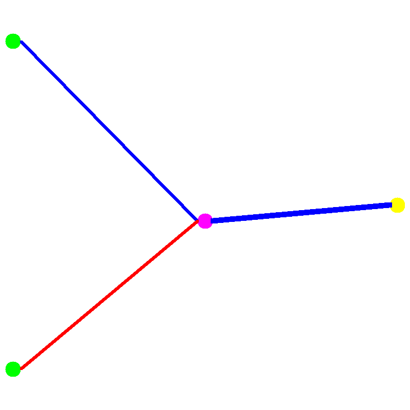
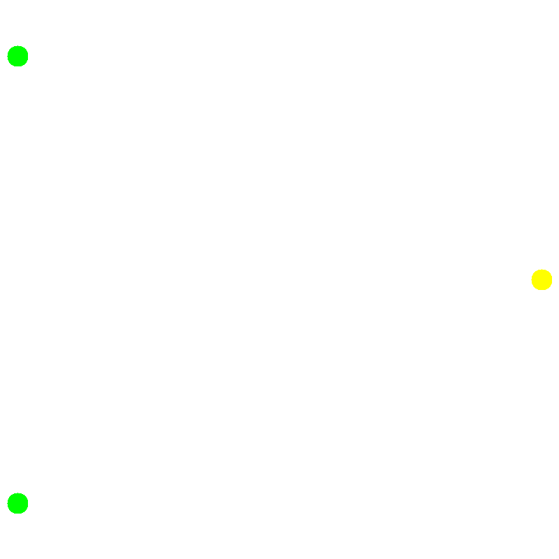
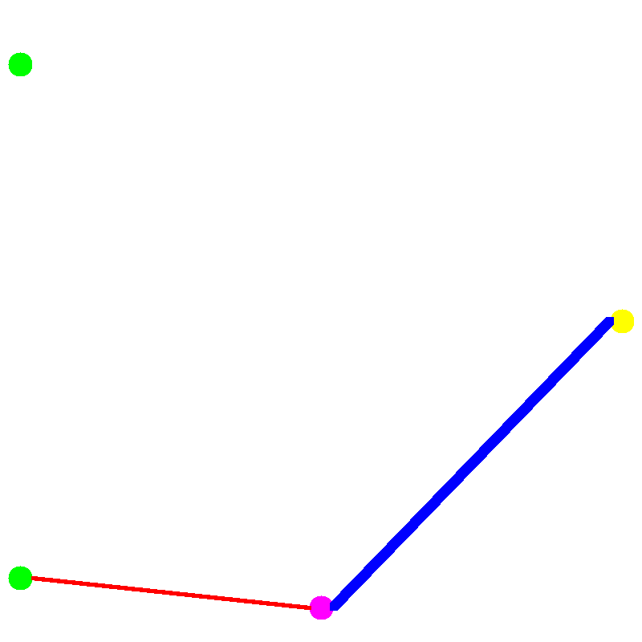

# `goevo` - work-in-progress NEAT implementation in Golang
GoEVO is designed to be a fast but easy-to-understand package that implements the NEAT algorithm. It is still in development and has not had a major release yet, so stability is not guaranteed. If you find a bug or have any suggestions, please do raise an issue and i'll try to fix it. \
To learn more about the NEAT algorithm, here is the original paper: [Stanley, K. O., & Miikkulainen, R. (2002). Evolving neural networks through augmenting topologies. Evolutionary computation, 10(2), 99-127.](https://nn.cs.utexas.edu/downloads/papers/stanley.ec02.pdf)
## Usage
### The Basics
#### Creating and Modifying a `Genotype`
A Genotype is a bit like DNA - it encodes all the information to build the network.
```go
// Create a counter. This is used to keep track of new neurons and synapses
counter := goevo.NewAtomicCounter()

// Create the initial genotype. This is sort of like an agents DNA.
genotype := goevo.NewGenotype(counter, 2, 1, goevo.ActivationLinear, goevo.ActivationSigmoid)

// Add a synapse from first input to output with a weight of 0.5.
// We don't need to check the error because we know this is a valid modification
synapseID, _ := genotype.AddSynapse(counter, 0, 2, 0.5)
// Add a neuron on the synapse we just created
neuronID, secondSynapseID, _ := genotype.AddNeuron(counter, synapseID, goevo.ActivationReLU)
// Add a synapse between the second input and our new neuron with a weight of -0.5
genotype.AddSynapse(counter, 1, neuronID, -0.5)
```
#### Visualising a `Genotype`
It is quite hard to deduce the topology by looking its list of neurons and synapses. `goevo` supports drawing a picture of a genotype either to a `draw.Image` or a `png` or `jpg` file.
```go
vis := goevo.NewGenotypeVisualiser()
vis.DrawImageToPNGFile("example_1.png", genotype)
```
Below is the image in the generated file `example_1.png`. The green cirlces are input neurons, pink circles are hidden neurons, and yellow circles are output neurons. A blue line is a positive weight and a red line is a negative weight. The thicker the line, the stronger the weight.



#### Pruning Synapses
One way to prevent the networks getting too big is to prune synapses (delete synapses). Pruning will remove the given synapse then remove all neurons and synapses that become redundant due to the pruning.
```go
// Prune the synapse that connects the hidden neuron to the output neuron. This makes the hidden neuron nedundant so it is therefor removed too, along with its other synapses.
genotypePrunedA := goevo.NewGenotypeCopy(genotype)
genotypePrunedA.PruneSynapse(secondSynapseID)
vis.DrawImageToPNGFile("example_2.png", genotypePrunedA)
// Prune the synapse that connects the first input to the hidden neuron
genotypePrunedB := goevo.NewGenotypeCopy(genotype)
genotypePrunedB.PruneSynapse(synapseID)
vis.DrawImageToPNGFile("example_3.png", genotypePrunedB)
```

Below is `example_2.png`. Because the removed synapse was the only synapse connecting the hidden node to an output node, the hidden node was removed with the synapse, along with its synapses.



Below is `example_3.png`. The hidden node still had a connection going in and a connection going out after this pruning so it was not removed.



#### Using the `Genotype`
A Genotype cannot directly be used to convert an input into an output. Instead, it must first be converted into a Phenotype, which can be thought of a bit like compiling code into an executable. After a Phenotype is created, it can be used as many times as you like, but the neurons and synapses cannot be edited (to do this you have to modify the genotype and create a new phenotype).
```go
// Create a phenotype from the genotype
phenotype := goevo.NewPhenotype(genotype)
// Calculate the outputs given some inputs
fmt.Println(phenotype.Forward([]float64{0, 1}))
fmt.Println(phenotype.Forward([]float64{1, 0}))
// Make sure to clear any recurrent connections memory (in this case there are no recurrent connections but this is just an exmaple)
phenotype.ClearRecurrentMemory()
```
Output:
```
[0.5]
[0.6224593312018546]
```

#### Saving and Loading `Genotype`
If you have just trained a genotype, you may wish to save it. Genotypes can be json marshalled und unmarshalled with go's build in json parser.
```go
// Convert the genotype to a json []byte
jsBytes, _ := json.Marshal(genotype)
// Create an empty genotype and load the json []byte into it
genotypeLoaded := goevo.NewGenotypeEmpty()
json.Unmarshal(jsBytes, genotypeLoaded)
```